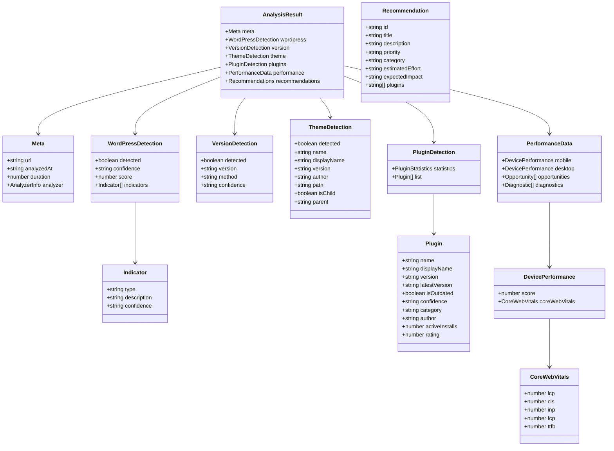
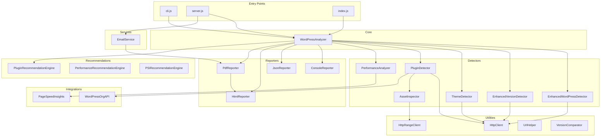
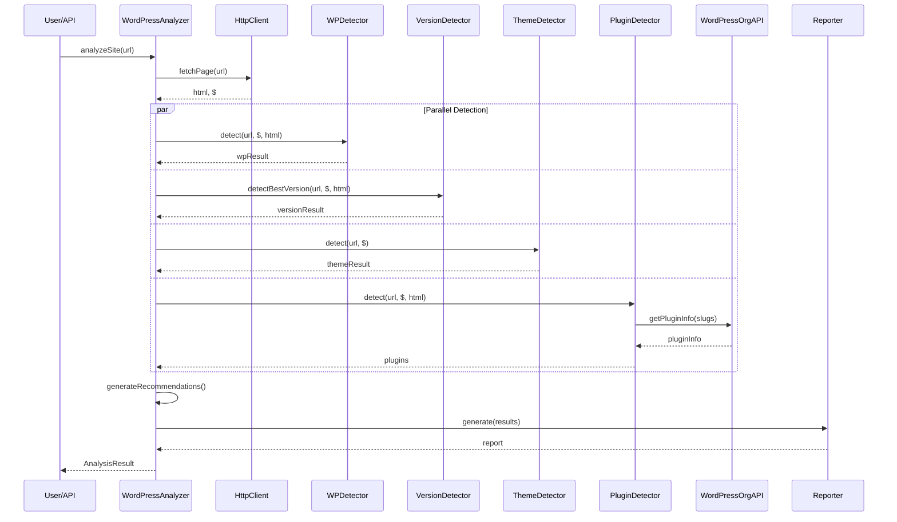

# Class Diagram

**Project:** WordPress Site Analyzer
**Generated:** 2026-01-20

## Main Class Hierarchy

```mermaid
classDiagram
    %% Main Orchestrator
    class WordPressAnalyzer {
        -HttpClient httpClient
        -EnhancedWordPressDetector wordpressDetector
        -EnhancedVersionDetector versionDetector
        -ThemeDetector themeDetector
        -PluginDetector pluginDetector
        -PerformanceAnalyzer performanceAnalyzer
        -ConsoleReporter consoleReporter
        -JsonReporter jsonReporter
        -HtmlReporter htmlReporter
        -PdfReporter pdfReporter
        -PluginRecommendationEngine recommendationEngine
        +analyzeSite(url, options) Promise~AnalysisResult~
        +quickDetect(url) Promise~QuickResult~
        +analyzeMultipleSites(urls) Promise~Array~
        +generateReport(results) string
        +generateJsonReport(results) Object
        +generateHtmlReport(results) string
        +generatePdfReport(results) Promise~Buffer~
        +generateSummary(results) string
        +getInfo() Object
    }

    %% Detectors
    class EnhancedWordPressDetector {
        -HttpClient httpClient
        +detect(baseUrl, $, html) Promise~DetectionResult~
        -detectFromMetaGenerator($) Indicator
        -detectFromPaths($, html) Indicator[]
        -detectFromCssClasses($) Indicator[]
        -detectFromScripts($) Indicator[]
        -detectFromRest(baseUrl) Promise~Indicator~
        -calculateConfidence(indicators) number
    }

    class EnhancedVersionDetector {
        -HttpClient httpClient
        +detectBestVersion(baseUrl, $, html) Promise~VersionResult~
        -detectFromMetaGenerator($) VersionCandidate
        -detectFromReadme(baseUrl) Promise~VersionCandidate~
        -detectFromScripts($) VersionCandidate[]
        -detectFromStylesheets($) VersionCandidate[]
        -detectFromOpml(baseUrl) Promise~VersionCandidate~
        -detectFromRssFeed(baseUrl) Promise~VersionCandidate~
        -validateVersion(version) boolean
    }

    class ThemeDetector {
        -HttpClient httpClient
        +detect(baseUrl, $) Promise~ThemeResult~
        -detectFromStylesheet($, baseUrl) ThemeCandidate
        -detectFromBodyClass($) string
        -parseStyleCss(url) Promise~ThemeInfo~
        -enrichThemeData(theme) Promise~ThemeResult~
    }

    class PluginDetector {
        -HttpClient httpClient
        -AssetInspector assetInspector
        -WordPressOrgAPI wordpressApi
        +detect(baseUrl, $, html) Promise~PluginResult[]~
        -detectFromAssets($, baseUrl) PluginCandidate[]
        -detectFromPatterns(html) PluginCandidate[]
        -detectFromSelectors($) PluginCandidate[]
        -detectFromRestApi(baseUrl) Promise~PluginCandidate[]~
        -detectFromJsVariables(html) PluginCandidate[]
        -enrichPluginData(plugins) Promise~Plugin[]~
        -checkOutdatedStatus(plugin) Promise~Plugin~
    }

    class AssetInspector {
        -HttpRangeClient httpRange
        +inspectAssets(assetUrls) Promise~AssetInfo[]~
        +inspectAssetsOptimized(assetUrls) Promise~AssetInfo[]~
        -extractSourceMapUrl(buffer) string
        -extractPluginInfoFromComments(buffer) PluginInfo
        -inspectSourceMap(assetUrl, mapUrl) Promise~SourceMapInfo~
    }

    class PerformanceAnalyzer {
        -PageSpeedInsights psi
        +analyze() Promise~PerformanceResult~
        -analyzeMainPageTiming() TimingData
        -analyzePluginPerformance() PluginPerfData
        -analyzePageSpeedInsights() Promise~PSIData~
        -generateRecommendations() Recommendation[]
    }

    %% Reporters
    class ConsoleReporter {
        +generate(results) string
        -generateHeader(results) string
        -generateWordPressSection(results) string
        -generateVersionSection(results) string
        -generateThemeSection(results) string
        -generatePluginsSection(results) string
        -formatPluginEntry(plugin) string
        +generateCompactSummary(results) string
    }

    class JsonReporter {
        +generate(results, options) Object
        -generateMeta(results) Object
        -generateWordPressSection(results) Object
        -generateVersionSection(results) Object
        -generateThemeSection(results) Object
        -generatePluginsSection(results) Object
        -generatePerformanceSection(results) Object
        -generateRecommendationsSection(results) Object
    }

    class HtmlReporter {
        +generate(results, options) string
        -generateStyles() string
        -generateScripts() string
        -generateHeader(results) string
        -generateSections(results) string
        -generatePluginTable(plugins) string
    }

    class PdfReporter {
        +generate(results, options) Promise~Buffer~
        +generateWithFilename(results) Promise~Object~
        +generatePrintOptimized(results) Promise~Buffer~
        +generateLandscape(results) Promise~Buffer~
        -getHeaderTemplate() string
        -getFooterTemplate() string
        -getLogoData() string
    }

    %% Recommendation Engines
    class PluginRecommendationEngine {
        +generateRecommendations(results) Promise~Recommendations~
        -performEnhancedAssetAnalysis(results) AssetAnalysis
        -identifyOptimizationOpportunities(results) Opportunity[]
        -generateIntegratedRecommendations(results) Recommendation[]
        -calculateEnhancedScore(results) number
        -mergeAndDeduplicateRecommendations(recs) Recommendation[]
        +getTopRecommendations(recs, count) Recommendation[]
        +exportRecommendations(recs, format) string
    }

    class PerformanceRecommendationEngine {
        +analyzePerformanceAndRecommend(results) Promise~Recommendations~
        -identifyPerformanceIssues(results) Issue[]
        -generateRecommendationsForIssue(issue) Recommendation[]
        -calculatePerformanceScore(results) number
        -generatePerformanceSummary(results) Summary
    }

    class PSIRecommendationEngine {
        +generateRecommendations(psiData) Recommendations
        -generateOpportunityRecommendations(opps) Recommendation[]
        -generateDiagnosticRecommendations(diags) Recommendation[]
        -generateCWVRecommendations(cwv) Recommendation[]
        -generateAccessibilityRecommendations(a11y) Recommendation[]
        -generateSummary(recs) Summary
    }

    %% Integrations
    class WordPressOrgAPI {
        -requestQueue Queue
        +getPluginInfo(slug) Promise~PluginInfo~
        +getMultiplePluginsInfo(slugs) Promise~PluginInfo[]~
        -processQueue() void
        -fetchPluginInfo(slug) Promise~PluginInfo~
        -extractPluginSlug(identifier) string
    }

    class PageSpeedInsights {
        +fetchBoth(url, apiKey) Promise~PSIResult~
        +fetch(url, strategy, apiKey) Promise~PSIData~
        -fetchSingle(url, strategy, apiKey) Promise~PSIData~
        -fetchWithRetry(url, strategy, apiKey) Promise~PSIData~
        -extractCoreWebVitals(audits) CWV
        -extractOpportunities(audits) Opportunity[]
        -extractDiagnostics(audits) Diagnostic[]
        -calculateSavings(audit) Savings
    }

    %% Services
    class EmailService {
        -transporter Transporter
        +sendAnalysisReport(email, results, pdf) Promise~void~
        -generateEmailContent(results) string
        -getLogoData() string
        +isValidEmail(email) boolean
        +testConnection() Promise~boolean~
        +sendTestEmail(email) Promise~void~
    }

    %% Utilities
    class HttpClient {
        +fetchPage(url, options) Promise~Response~
        +fetchWithRetry(url, options) Promise~Response~
    }

    class HttpRangeClient {
        +fetchRange(url, start, end) Promise~Buffer~
        +fetchHead(url, size) Promise~Buffer~
        +fetchTail(url, size) Promise~Buffer~
    }

    class UrlHelper {
        +normalizeUrl(url)$ string
        +extractDomain(url)$ string
        +resolveUrl(base, relative)$ string
    }

    class VersionComparator {
        +compare(v1, v2)$ number
        +isNewer(v1, v2)$ boolean
        +isOlder(v1, v2)$ boolean
    }

    %% Analysis
    class FunctionalityGapAnalyzer {
        +analyzeFunctionality(results) FunctionalityAnalysis
        -detectFunctionality(html, plugins) FunctionalityMap
        -getRelatedPlugins(category) Plugin[]
        -getRecommendationsForCategory(category) Recommendation[]
        -calculateFunctionalityScore(analysis) number
    }

    %% Relationships
    WordPressAnalyzer --> EnhancedWordPressDetector
    WordPressAnalyzer --> EnhancedVersionDetector
    WordPressAnalyzer --> ThemeDetector
    WordPressAnalyzer --> PluginDetector
    WordPressAnalyzer --> PerformanceAnalyzer
    WordPressAnalyzer --> ConsoleReporter
    WordPressAnalyzer --> JsonReporter
    WordPressAnalyzer --> HtmlReporter
    WordPressAnalyzer --> PdfReporter
    WordPressAnalyzer --> PluginRecommendationEngine
    WordPressAnalyzer --> HttpClient

    EnhancedWordPressDetector --> HttpClient
    EnhancedVersionDetector --> HttpClient
    ThemeDetector --> HttpClient
    PluginDetector --> HttpClient
    PluginDetector --> AssetInspector
    PluginDetector --> WordPressOrgAPI
    AssetInspector --> HttpRangeClient
    PerformanceAnalyzer --> PageSpeedInsights

    PluginRecommendationEngine --> PerformanceRecommendationEngine
    PluginRecommendationEngine --> PSIRecommendationEngine
    PluginRecommendationEngine --> FunctionalityGapAnalyzer

    PdfReporter --> HtmlReporter

    EmailService --> PdfReporter
```

## Data Types

```mermaid
classDiagram
    class AnalysisResult {
        +Meta meta
        +WordPressDetection wordpress
        +VersionDetection version
        +ThemeDetection theme
        +PluginDetection plugins
        +PerformanceData performance
        +Recommendations recommendations
    }

    class Meta {
        +string url
        +string analyzedAt
        +number duration
        +AnalyzerInfo analyzer
    }

    class WordPressDetection {
        +boolean detected
        +string confidence
        +number score
        +Indicator[] indicators
    }

    class Indicator {
        +string type
        +string description
        +string confidence
    }

    class VersionDetection {
        +boolean detected
        +string version
        +string method
        +string confidence
    }

    class ThemeDetection {
        +boolean detected
        +string name
        +string displayName
        +string version
        +string author
        +string path
        +boolean isChild
        +string parent
    }

    class PluginDetection {
        +PluginStatistics statistics
        +Plugin[] list
    }

    class Plugin {
        +string name
        +string displayName
        +string version
        +string latestVersion
        +boolean isOutdated
        +string confidence
        +string category
        +string author
        +number activeInstalls
        +number rating
    }

    class PerformanceData {
        +DevicePerformance mobile
        +DevicePerformance desktop
        +Opportunity[] opportunities
        +Diagnostic[] diagnostics
    }

    class DevicePerformance {
        +number score
        +CoreWebVitals coreWebVitals
    }

    class CoreWebVitals {
        +number lcp
        +number cls
        +number inp
        +number fcp
        +number ttfb
    }

    class Recommendation {
        +string id
        +string title
        +string description
        +string priority
        +string category
        +string estimatedEffort
        +string expectedImpact
        +string[] plugins
    }

    AnalysisResult --> Meta
    AnalysisResult --> WordPressDetection
    AnalysisResult --> VersionDetection
    AnalysisResult --> ThemeDetection
    AnalysisResult --> PluginDetection
    AnalysisResult --> PerformanceData

    WordPressDetection --> Indicator
    PluginDetection --> Plugin
    PerformanceData --> DevicePerformance
    DevicePerformance --> CoreWebVitals
```

## Module Dependencies

```mermaid
graph TD
    subgraph Entry Points
        CLI[cli.js]
        SRV[server.js]
        IDX[index.js]
    end

    subgraph Core
        WPA[WordPressAnalyzer]
    end

    subgraph Detectors
        WPD[EnhancedWordPressDetector]
        VER[EnhancedVersionDetector]
        THM[ThemeDetector]
        PLG[PluginDetector]
        AST[AssetInspector]
        PRF[PerformanceAnalyzer]
    end

    subgraph Reporters
        CON[ConsoleReporter]
        JSN[JsonReporter]
        HTM[HtmlReporter]
        PDF[PdfReporter]
    end

    subgraph Recommendations
        PLE[PluginRecommendationEngine]
        PRE[PerformanceRecommendationEngine]
        PSI[PSIRecommendationEngine]
    end

    subgraph Integrations
        WPO[WordPressOrgAPI]
        PSA[PageSpeedInsights]
    end

    subgraph Services
        EML[EmailService]
    end

    subgraph Utilities
        HTTP[HttpClient]
        RNG[HttpRangeClient]
        URL[UrlHelper]
        CMP[VersionComparator]
    end

    CLI --> WPA
    SRV --> WPA
    IDX --> WPA

    WPA --> WPD
    WPA --> VER
    WPA --> THM
    WPA --> PLG
    WPA --> PRF
    WPA --> CON
    WPA --> JSN
    WPA --> HTM
    WPA --> PDF
    WPA --> PLE

    WPD --> HTTP
    VER --> HTTP
    THM --> HTTP
    PLG --> HTTP
    PLG --> AST
    PLG --> WPO
    AST --> RNG
    PRF --> PSA

    PDF --> HTM

    SRV --> EML
    EML --> PDF
```

## Sequence: Site Analysis

```mermaid
sequenceDiagram
    participant U as User/API
    participant WPA as WordPressAnalyzer
    participant HTTP as HttpClient
    participant WPD as WPDetector
    participant VER as VersionDetector
    participant THM as ThemeDetector
    participant PLG as PluginDetector
    participant WPO as WordPressOrgAPI
    participant REP as Reporter

    U->>WPA: analyzeSite(url)
    WPA->>HTTP: fetchPage(url)
    HTTP-->>WPA: html, $

    par Parallel Detection
        WPA->>WPD: detect(url, $, html)
        WPD-->>WPA: wpResult
    and
        WPA->>VER: detectBestVersion(url, $, html)
        VER-->>WPA: versionResult
    and
        WPA->>THM: detect(url, $)
        THM-->>WPA: themeResult
    and
        WPA->>PLG: detect(url, $, html)
        PLG->>WPO: getPluginInfo(slugs)
        WPO-->>PLG: pluginInfo
        PLG-->>WPA: plugins
    end

    WPA->>WPA: generateRecommendations()
    WPA->>REP: generate(results)
    REP-->>WPA: report
    WPA-->>U: AnalysisResult
```
